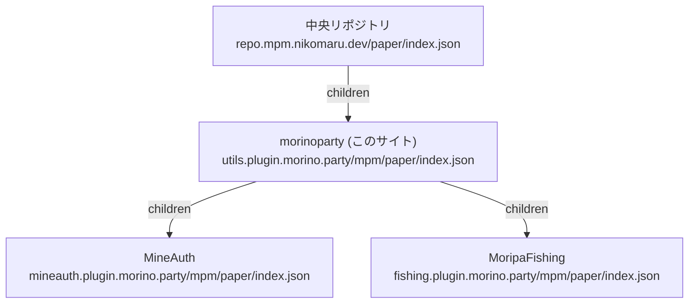

# mpm リポジトリ

このサイト (`utils.plugin.morino.party`) は、Minecraft プラグインマネージャー [mpm](https://mpm.plugin.morino.party) のリポジトリグラフにおいて、morinoparty のノードとして機能します。
morinoparty が開発しているプラグインの定義を配信し、さらに MineAuth や MoripaFishing などの個別プラグインが配信する子リポジトリへのリンクを持ちます。

以前は morinoparty のプラグイン定義を mpm の中央リポジトリ (`repo.mpm.nikomaru.dev`) が直接持っていましたが、現在はこのリポジトリに移管されています。
中央リポジトリはこのサイトの `index.json` へのリンクだけを持ち、morinoparty のプラグインの追加や変更は中央リポジトリを変更せずに行えます。

## リポジトリグラフ

mpm のクライアントは中央リポジトリの `index.json` を起点に、`children` に書かれたリンクを再帰的にたどってカタログを組み立てます。
このサイトの位置付けは次の図のとおりです。



同じ名前のプラグインが複数のノードに定義されている場合は、祖先側 (中央に近い側) の定義が優先されます。
そのため、子リポジトリが親の定義を上書きすることはできません。
グラフの形式の詳細は mpm の [リポジトリグラフの仕様](https://mpm.plugin.morino.party/docs/repository/graph) を参照してください。

## 配信されるファイル

| URL | 内容 |
|-----|------|
| `https://utils.plugin.morino.party/mpm/paper/index.json` | morinoparty のプラグイン定義と子リポジトリへのリンクをまとめたインデックス |

`index.json` はドキュメントサイトのビルド時に `docs/scripts/build-mpm-index.mjs` によって生成されます。
生成元となるファイルは次のとおりです。

| ファイル | 内容 |
|---------|------|
| `docs/mpm/plugins/*.json` | プラグインごとの定義 (1 プラグインにつき 1 ファイル) |
| `docs/mpm/children.json` | 子リポジトリへのリンクの一覧 |

生成された `docs/public/mpm/paper/index.json` はビルド成果物であるため、Git の管理対象には含まれません。
`docs/` 以下の変更が `main` ブランチにマージされると、ドキュメントのデプロイワークフローによってサイトと一緒に `index.json` が再生成され、公開されます。

手元で生成結果を確認する場合は、次のコマンドを実行します。

```bash
cd docs
pnpm run build:mpm-index
```
